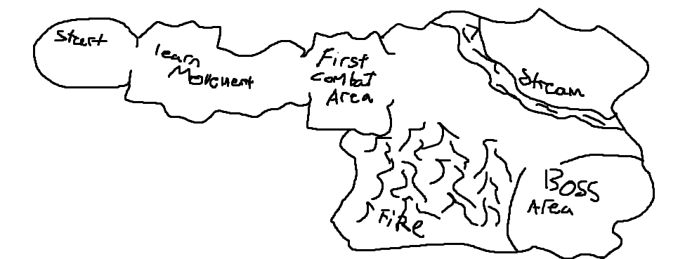
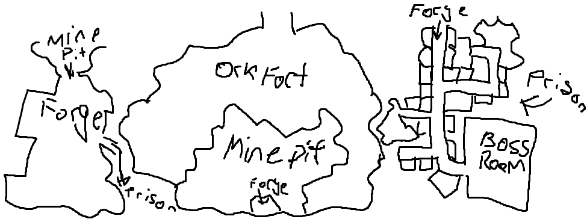
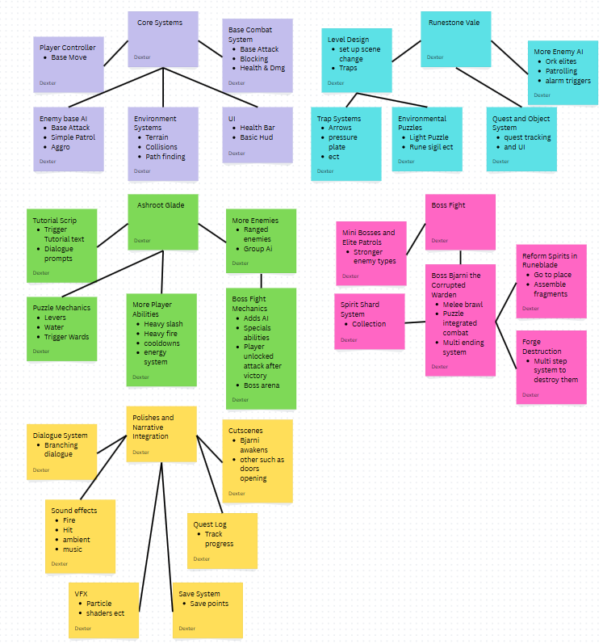

# Defence of Thornvail
## Table Of Contents
- [How to Play](#how-to-play)
	- [Controls](#controls)
   	- [How to Run](#how-to-run)
- [Preplanning](#preplanning)
  	- [What made the original game great](#hwhat-made-the-original-a-game-great)
  	- [How My Game Is Diffirent](#how-my-game-is-diffirent)
  	- [Story Plan](#story-plan)
  		- [Background](#background)
  	   	- [First Level](#first-level)
  	   	- [Second Level](#second-level)
  	- [Gameplay Plan](#gameplay-plan)
  		- [General](#general)
  	  	- [First Level](#first-level)
  	  	- [Second Level](#second-level)
  	- [Production Plan](#production-plan)
  	- [If i get more time](#if-i-get-more-time)
  	- [Assets](#assets)
- [Prototypes](#prototypes)
  	- [Prototype 1](#prototype-1)
  		- [Important Additions](#important-additions)
  	   	- [Video of Functionality (link to youtube)](#video-of-functionality-link-to-youtube)
  	   	- [Issues](#issues)
  	   	- [Next Steps](#next-steps)
- [Reflection](#reflection)
  	- [How is the overall design](#how-is-the-overall-design)
  	- [What changes could i make](#what-changes-could-i-make)
  	- [What would i do diffirently](#what-would-i-do-diffirently)
  	- [Issues I Encountered](#issues-i-encountered)
  	- [What have i learnt](#what-have-i-learnt)

## How to Play
### Controls
W, A, S, D for movement. <br>
Left Click is your basic attack. <br>
Right Click is Block. <br>
E Slash Attack <br>
R Heavy Attack <br>
F interact.  <br>
Left shift for dash. <br>
ESC to enter the menu <br>

## Preplanning
### What Made the Original a Game Great
The Legend of Zelda revolutionized video game design with its expansive open world, non-linear exploration, and blend of action and puzzle-solving. Players controlled Link through the vast land of Hyrule, navigating forests, mountains, and hidden dungeons while collecting items, solving puzzles, and defeating enemies. Unlike most games of the time, Zelda encouraged free exploration, allowing players to tackle challenges in nearly any order and rewarding curiosity with secrets and upgrades. It also introduced a persistent inventory system that remixed the game for added challenge after completion.

Zelda was groundbreaking—it was the first console game to use battery-backed memory, allowing players to save their progress without passwords. This, along with clever use of memory management, enabled a world much larger and deeper than what was typical for the NES. Critically acclaimed and commercially successful, The Legend of Zelda sold over 6.5 million copies worldwide and set the standard for action-adventure games. Its influence is still seen today in open-world design, and it remains one of gaming's most iconic and celebrated titles.

### How My Game is Diffirent
It is not Zelda.

### Story and Gameplay Plan 
#### Background
Thornvail a vast magical forest that once served as a natural barrier between human and ork lands, until some ancient force was lost. The forest is ancient and full of secrets, ruins, puzzles and mysteries. It is now under siege by an army of Orks. 
 
The orks are led by the warlord Brokil the Flame-Eater, who broke the forest's magical barrier. In doing so they’ve unleashed wild magic, warping the environment and awakening dangerous creatures. Their goal, to conquer and claim the Heart of the Forest, a source of immense power. 

Brokil has sent his General, Blazetooth an ork beast warden to scout and raise the forest allowing the orks to advance into the heartland of thornvail. Your kigndom has sent you to stop his incersion and push back the ork threat. 

#### First level - Ashroot Glade 
📜 Awakening in the Ash <br>
Objective: You arrive in a grove scarred by flame. The air is thick with smoke, and the earth is charred. <br> 
You Must: <br>
* Move through the grove learning basic movement. <br>
* Explore the enviroment. <br>
* Meet a dying guardian spirit.

📜 First Blood on Burning Leaves <br>
Objective: Ork scouts are patrolling the outer grove. A test of steel and courage. <br>
You Must: <br>
* Engage in your first combat encounter and learn its mechanics. <br>
* Survive two short fights: one vs a lone ork, then a group with a ranged attacker. <br>

📜 Embers in the Roots <br>
Objective: The grove’s ancient trees are aflame. If not stopped, the warding magic here will collapse completely. <br>
You Must: <br>
* Redirect the nearby stream to put out the fire. <br>
* Activate an ancient ward node after extinguishing the fire. <br>

📜 The Beastmaster’s Trail <br>
Objective: A hulking ork known as Blazetooth is capturing corrupted beasts and razing key glades.
You Must: <br>
* Track Blazetooth by following claw marks and broken trees.
* Defeat any encountered patrols of orks.

📜 Trial by Flame – Blazetooth <br>
Objective: Defeat Blazetooth, the ork beastmaster, and save the forest from complete destruction.
You Must: <br>
* Enter the burning grove to face Blazetooth and his warped pets.
* Use what you learned through the tutorial to defeat him.
* Unlock the way to Runestone Vale.
  
#### Level Map - Ashroot Glade


#### Second level - Runestone Vale
📜 Behind Enemy Vines <br>
Objective: You've breached the perimeter of Runestone Vale, a newly constructed ork fortresss. <br>
You Must: <br>
* Infiltrate the ork camp's perimeter.
* Disable two watchtowers to prevent reinforcments.
* Question a captured guardian to learn what the orks are doing in the vale.

📜 Chains Beneath the Stones <br>
Objective: Discover the source of corrupted magical surges. <br>
You Must: <br>
* Explore the lower mining pit where the orks are unearthing ancient wards.
* Navigate the mines to reach the inner prison vault.
* Witness the source of the magical surges.

📜 The Warden's Remains <br>
Objective: To weaken Bjarni's bindings, you must reclaim shards of his spirit to help free his mind.
* Recover pieces of Bjarni's spirit (It is not required to recover all shards but it will make the boss fight easier)
* Desecrated Grove - defend a guardians last stand to recieve shard
* Ork Ritual Pit - Interrupt a dark ritual and steal back a shard.
* Broken Shrine - Repair the shrine to collect a shard.

📜 Camp of Iron and Flame <br>
Objective: Strike at the heart of the ork operation, a forge where they're creating twisted weapons powered by stolen magic. <br>
You Must: <br>
* Destroy enchanted forges
* Free prisoners
* Collect runeblade fragments

📜 The Corrupted Warden - Bjarni <br>
Objective: Bjarni has been chained, tortured, and twisted by the orks. You now face him in a corrupted arena to stop his release. <br>
You Must: <br>
* Enter the central prison. Solve puzzles in combat and break his chains.
* Phase 1: Bjarni in his corrupted state rampages through the room.
* Phase 2: step on rune sigils and align lights to weaken him.
* Phase 3: Use the runeblade and the spirite shards to either - Cleanse his corruption (if all shards were collected) or 'end' his corruption 

#### Level Map - Runestone Vale


#### Player Progression
You start as a knight in the kingdom of Thornvail, during the tutorial you learn basic movement and your base attack and block, later you learn two special abilitys one slash heavy attack and a heavy fire attack you get after defeating the first boss. 

### Flowcharts (Production plan)


### Assets
Below are the links to all the itch.io pages where i found my assets. <br>
Used for the game ennviroment and terrain, https://aamatniekss.itch.io/topdown-fantasy-forest <br>
Most of the NPC's can be found here, https://zerie.itch.io/tiny-rpg-character-asset-pack <br>
GUI https://mounirtohami.itch.io/pixel-art-gui-elements <br>
More GUI https://greatdocbrown.itch.io/gamepad-ui <br>
Font https://mounirtohami.itch.io/minimalpixel-font <br>
https://tekilor.itch.io/2d-fires-pack-2

## Prototyping
### Prototype 1 - Core Systems
#### Important Additions - Player Controller, Base combat (player and enemie), Enemie patrol (basic)
##### Player Controller
```gd
	var direction: Vector2 = Vector2.ZERO
	direction.x = Input.get_action_strength("Right") - Input.get_action_strength("Left")
	direction.y = Input.get_action_strength("Back") - Input.get_action_strength("Forward")
	direction = direction.normalized()
 ```
 
```gd
if Input.is_action_just_pressed("dash") and not is_dashing and dash_cooldown_timer <= 0:
	is_dashing = true
	dash_timer = dash_duration
	dash_cooldown_timer = dash_cooldown
	velocity = direction * dash_speed 
  
  	if direction.y < 0:
		sprite.rotation_degrees = flip_adjusted_angle(-simulate_updown_angle)
	elif direction.y > 0:
		sprite.rotation_degrees = flip_adjusted_angle(simulate_updown_angle)
	else:
		sprite.rotation_degrees = 0
```

##### Combat - Player and Enemie 
```gd
if Input.is_action_just_pressed("attack_light") and can_attack:
	light_attack()
	print("Light Attack")

func light_attack():
	can_attack = false
	base_attack_shape.disabled = false  # Enable hitbox
	
	sprite.play("Attack1")

	await get_tree().create_timer(0.1).timeout  # Small delay for hit detection

	for body in base_attack.get_overlapping_bodies():
		if body.is_in_group("enemies"):
			body.take_damage(5)

	base_attack_shape.disabled = true  # Disable hitbox again

	await get_tree().create_timer(0.6).timeout  # Cooldown delay
	can_attack = true

```
```gd
if distance <= attack_range and can_attack:
	attack()
func _on_attack_cooldown_timeout():
	can_attack = true

func attack(): 
	can_attack = false
	attack_cooldown_timer.start(attack_cooldown)
	
	player.take_damage(attack_damage)
	print("Enemy attacked player")
```
##### Enemie Patrol

#### Video of Functionality (link to youtube)

#### Issues 

#### Next Steps

### Prototype 2 - Ashroot Glade Part 1
#### Important Additions 
#### Video of Functionality (link to youtube)

#### Issues 

#### Next Steps

### Prototype 3 - Ashroot Glade Part 2
#### Important Additions 

#### Video of Functionality (link to youtube)

#### Issues 

#### Next Steps

### Prototype 4 - Runestone Vale Part 1
#### Important Additions 

#### Video of Functionality (link to youtube)

#### Issues 

#### Next Steps

### Prototype 5 - Runestone Vale Part 2
#### Important Additions 

#### Video of Functionality (link to youtube)

#### Issues 

#### Next Steps

### Prototype 6 - Runestone Vale Part 3
#### Important Additions 

#### Video of Functionality (link to youtube)

#### Issues 

#### Next Steps

### Prototype 7 - Boss Fight
#### Important Additions 

#### Video of Functionality (link to youtube)

#### Issues 

#### Next Steps

## Reflection 
### How is the overall design 

### What changes could i make

### What would i do diffirently 

### Issues I Encountered

### What have I learnt


 
